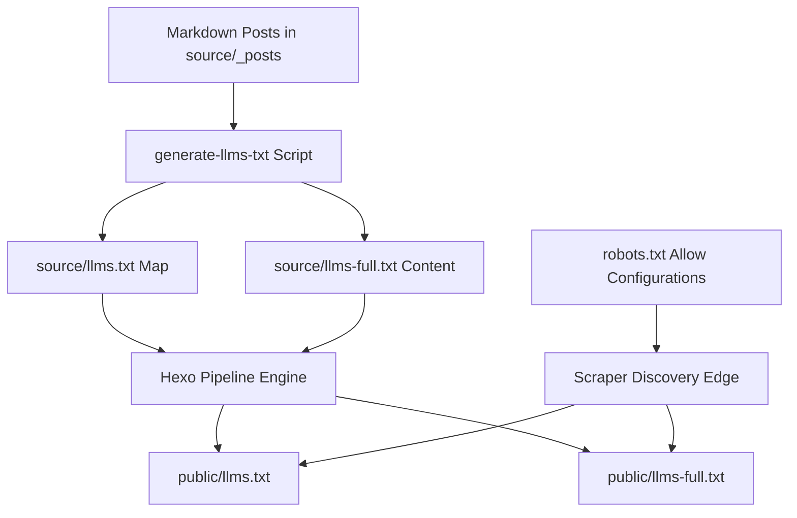

<!--
 Copyright 2026 Google LLC

 Licensed under the Apache License, Version 2.0 (the "License");
 you may not use this file except in compliance with the License.
 You may obtain a copy of the License at

      http://www.apache.org/licenses/LICENSE-2.0

 Unless required by applicable law or agreed to in writing, software
 distributed under the License is distributed on an "AS IS" BASIS,
 WITHOUT WARRANTIES OR CONDITIONS OF ANY KIND, either express or implied.
 See the License for the specific language governing permissions and
 limitations under the License.
-->

# AI Agent Indexing & Ingestion System

This document outlines the configurations, automated scripts, and edge networking policies designed to welcome and optimize AI crawlers, LLMs, and ingestion bots.

## 1. Subsystem Architecture

To facilitate zero-friction access by AI systems while keeping transfer size and parsing complex elements minimal, a dedicated indexing pipeline compiles structured documentation on every build:



## 2. Ingestion Briefs

### AI Main Entrypoint (`llms.txt`)
Serves as the central map served at the domain root (`/llms.txt`). It outlines biographical summaries, and links direct pathways to high-value portfolios (blog feed, speaker history, project inventories, and flat content aggregators).

### Dynamic Aggregated Corpus (`llms-full.txt`)
A consolidated plain-text index containing the complete body text of all published technical posts (sorted by date descending). 
To preserve bot scraping efficiency, this file is compiled using custom preprocessing operations:
- **Liquid Tag Extraction**: Translates complex Hexo liquid configurations (such as `` or ``) into clean markdown hypermedia anchors.
- **Visual Stripping**: Matches and strips heavy base64 image strings (which degrade text token limits), replacing them with readable metadata placeholders.
- **Link Normalization**: Converts relative references (e.g. `[my article](/path)`) and asset paths directly to fully-qualified absolute URLs pointing back to the core domain.

## 3. Edge Routing and Firewalls

While our codebase is structured to serve crawler payloads efficiently, edge configurations on global CDN providers (WAFs) must be aligned to prevent service denials:

### Cloudflare Bot Shield Policies
1. Access the **Cloudflare Dashboard** and navigate to your domain settings.
2. Select **Security** > **Bots** on the primary panel catalog.
3. Toggle the **Block AI Scrapers and Crawlers** control to **OFF** (allowing authorized bot user-agents to query paths).
4. Review your active **Web Application Firewall (WAF) Rules** to verify that generic HTTP agents do not trigger active challenges (CAPTCHAs), as automated search scrapers cannot parse verification widgets.

### Firebase Hosting Policies
Firebase Hosting operates on a resilient, serverless edge system. By default, it does not impose burst rate limits or structural blockades targeting crawlers unless custom Middlewares (Cloud Functions) or Armor Firewalls are bound. Our active static configuration operates under a robust CORS framework allowing remote crawlers to retrieve site index components with zero friction.

## 4. Subsystem Verification

To verify the generation script behaves correctly, run:
```bash
# Clean active assets
npm run clean

# Recompile core corpus and launch the Hexo compiler
npm run build
```

Verify that outputs populate:
1. `public/robots.txt`
2. `public/llms.txt`
3. `public/llms-full.txt`
