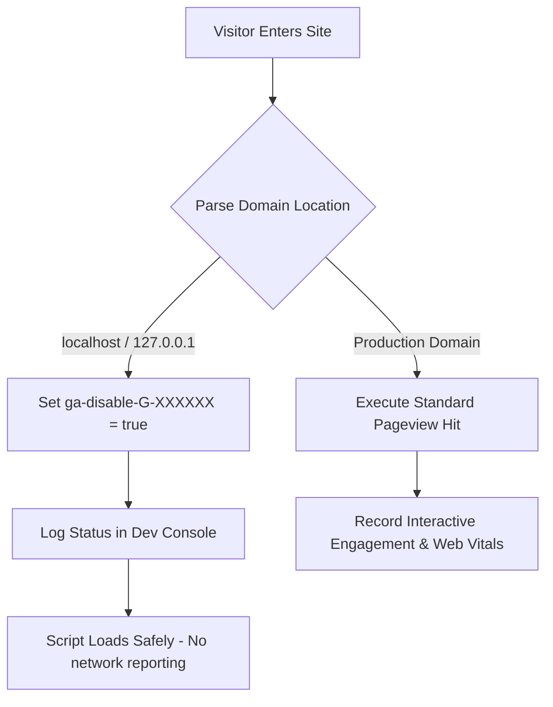

<!--
 Copyright 2026 Google LLC

 Licensed under the Apache License, Version 2.0 (the "License");
 you may not use this file except in compliance with the License.
 You may obtain a copy of the License at

      http://www.apache.org/licenses/LICENSE-2.0

 Unless required by applicable law or agreed to in writing, software
 distributed under the License is distributed on an "AS IS" BASIS,
 WITHOUT WARRANTIES OR CONDITIONS OF ANY KIND, either express or implied.
 See the License for the specific language governing permissions and
 limitations under the License.
-->

# Google Analytics Integration & Modernizations

This document specifies the custom Google Analytics 4 (GA4) integration architecture deployed inside the blog.

## Architectural Architecture Details

The system loads standard `gtag.js` tracking libraries dynamically, parsing the active environment bounds and properties using split configurations to minimize render-blocking layout shifts.



---

## Performance Enhancements

1. **Early Head Execution**: The tracking script is located at the absolute end of the HTML `<head>` tag. This lets the script capture high-bounce bounce sessions and initial engagement parameters reliably without render-blocking DOM parsing.
2. **DNS Pre-connection**: The layout maps explicit `preconnect` links to fast-track DNS parsing, TCP sockets and secure TLS layer validation upfront.
   - `https://www.googletagmanager.com` (Library bundle provider)
   - `https://www.google-analytics.com` (Analytics metrics ingestion network)

---

## Configuration & Environment Filtering

The system dynamic-resolves the tracking credentials using standard root configurations:

* File: `_config.yml`
* Parameter: `google_analytics: 'G-XXXXXXXXXX'`

### Local Hostname Filtering

To prevent development traffic from corrupting tracking patterns, a client-side environment interceptor automatically blocks tracking event payloads inside loop environments:

```javascript
if (window.location.hostname === 'localhost' || window.location.hostname === '127.0.0.1' || window.location.hostname.endsWith('.local')) {
  window['ga-disable-YOUR_MEASUREMENT_ID'] = true;
  console.log('Google Analytics is programmatically disabled on localhost.');
}
```

### Verification in Development

1. Open your local environment page: `http://localhost:4000/`.
2. Inspect the browser's **Developer Console** (`F12` / `Cmd+Option+I`).
3. Confirm the presence of the log: 
   `Google Analytics is programmatically disabled on localhost.`
4. Confirm in the network log that outgoing payloads to `/collect` targets are not active.
