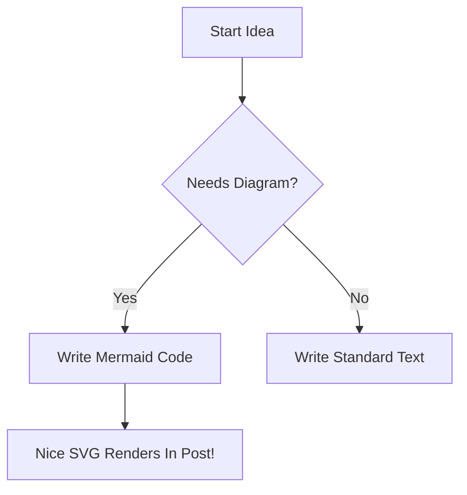
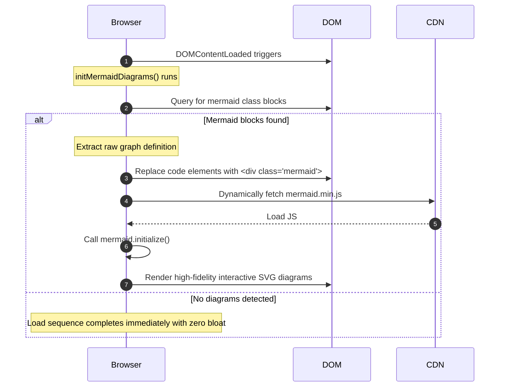

<!--
 Copyright 2026 Google LLC

 Licensed under the Apache License, Version 2.0 (the "License");
 you may not use this file except in compliance with the License.
 You may obtain a copy of the License at

      http://www.apache.org/licenses/LICENSE-2.0

 Unless required by applicable law or agreed to in writing, software
 distributed under the License is distributed on an "AS IS" BASIS,
 WITHOUT WARRANTIES OR CONDITIONS OF ANY KIND, either express or implied.
 See the License for the specific language governing permissions and
 limitations under the License.
-->

# Mermaid Diagram Support

This feature adds visual rendering support for Mermaid.js diagrams on blog post markdown pages.

## 🚀 Usage

To insert a diagram in your blog posts, simply use the standard markdown fence blocks and declare `mermaid`:



---

## ⚙️ Under The Hood Architecture

To prevent site bloat and maintain rapid load speeds, Mermaid is integrated **client-side and loaded on-demand**:



## 🎨 Themes & Styling
The default diagram rendering theme is set to `neutral` in `footer.ejs` to match the clean presentation of the developer site. You can configure custom themes, fonts, or colors inside `footer.ejs` by modifying the `mermaid.initialize()` argument:

```javascript
mermaid.initialize({
  startOnLoad: true,
  theme: 'neutral', // Available: 'default', 'forest', 'dark', 'neutral'
  securityLevel: 'loose'
});
```
