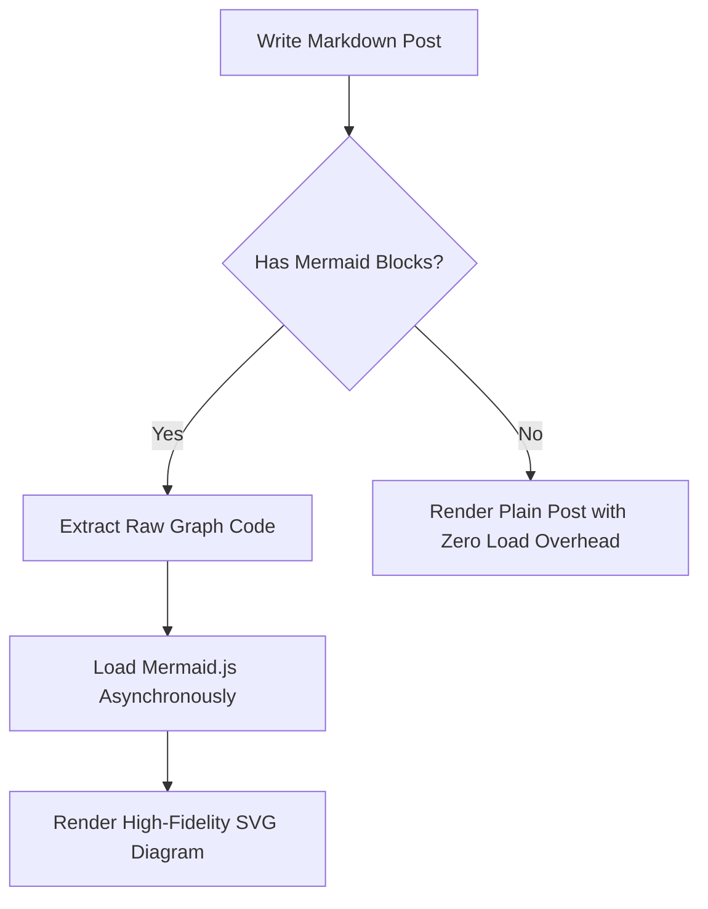
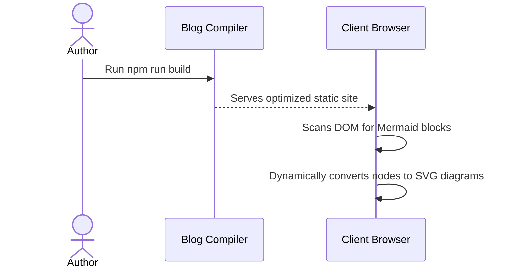

<!--
 Copyright 2026 Google LLC

 Licensed under the Apache License, Version 2.0 (the "License");
 you may not use this file except in compliance with the License.
 You may obtain a copy of the License at

      http://www.apache.org/licenses/LICENSE-2.0

 Unless required by applicable law or agreed to in writing, software
 distributed under the License is distributed on an "AS IS" BASIS,
 WITHOUT WARRANTIES OR CONDITIONS OF ANY KIND, either express or implied.
 See the License for the specific language governing permissions and
 limitations under the License.
-->

# Post Composition: Code Formatting and Diagram Rendering

This guide provides instructions on how to write articles with rich technical formatting, including interactive code editors and visual diagrams.

---

## 💻 Syntax Highlighting & Code Block Formatting

All code blocks written in Markdown are compiled and highlighted using **Prism.js** with a responsive, high-contrast theme (`atom-dark`).

### Writing a Code Block
Simply wrap your code block in standard Markdown triple backticks and declare the language (e.g., `python`, `typescript`, `html`, `css`, `bash`):

````markdown
```python
def greet_researcher(name: str) -> str:
    """Generate a greeting for a peer AI researcher."""
    return f"Hello, {name}! Welcome to the Exascale Cloud project."
```
````

### Rendering Result
The client-side Prism layout will render:
1. High-contrast keyword syntax highlighting.
2. Interactive scroll containers for wide blocks.
3. Automatic line number guides.

---

## 📊 Interactive Diagram Rendering (Mermaid.js)

The blog supports writing live diagrams directly in Markdown using standard **Mermaid.js** block syntax.

### Dynamic Architecture
To ensure fast initial load speeds, Mermaid is loaded **on-demand client-side**. A background interceptor scans the page on `DOMContentLoaded` for diagram syntax and imports the core render engine asynchronously ONLY when a diagram is detected on the current page.

### Writing a Flowchart
Use the `mermaid` language identifier and define the flow direction (e.g., `graph TD` or `graph LR`):

````markdown

````

### Writing a Sequence Diagram
Use the `sequenceDiagram` prefix:

````markdown

````

---

## ⚙️ Technical Configuration & Customization

The diagram styling theme is configured in `themes/leeboonstra/layout/_partial/footer.ejs`. By default, the site uses the `neutral` theme to maintain a clean and professional presentation style.

To customize themes, modify the `mermaid.initialize()` config block:
```javascript
mermaid.initialize({
  startOnLoad: true,
  theme: 'neutral', // Options: 'default', 'forest', 'dark', 'neutral'
  securityLevel: 'loose'
});
```
