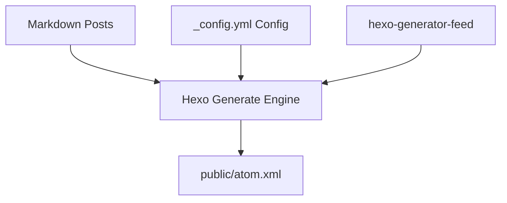

<!--
 Copyright 2026 Google LLC

 Licensed under the Apache License, Version 2.0 (the "License");
 you may not use this file except in compliance with the License.
 You may obtain a copy of the License at

      http://www.apache.org/licenses/LICENSE-2.0

 Unless required by applicable law or agreed to in writing, software
 distributed under the License is distributed on an "AS IS" BASIS,
 WITHOUT WARRANTIES OR CONDITIONS OF ANY KIND, either express or implied.
 See the License for the specific language governing permissions and
 limitations under the License.
-->

# RSS/Atom Feed Configuration and Subsystem

This document describes how the RSS/Atom subscription feed is generated, configured, and maintained.

## 1. System Architecture

The feed compilation is powered by the **`hexo-generator-feed`** plugin. During the static generation step (`hexo generate`), the plugin hooks into the pipeline to parse Markdown posts, filter out hidden posts, and construct a standards-compliant XML Atom feed.



## 2. Configuration Block

The feed configuration is defined in `_config.yml` under the `feed:` namespace:

```yaml
feed:
  type: atom
  path: atom.xml
  limit: 20
  hub:
  content:
  content_limit: 140
  content_limit_delim: ' '
  order_by: -date
  autodiscovery: true
```

### Key Parameters:
- **`type`**: The feed standard format (configured to `atom`).
- **`path`**: The public output path relative to the site root (`atom.xml`).
- **`limit`**: Total number of most recent posts to include in the feed payload (capped at `20`).
- **`autodiscovery`**: Enables browsers and RSS clients to automatically discover the feed via `<link>` tags.

## 3. Theme Integration

Autodiscovery tags are embedded within the standard HTML head layout:
*   **Location**: [themes/leeboonstra/layout/_partial/head.ejs](file:///themes/leeboonstra/layout/_partial/head.ejs)
*   **Markup**:
    ```html
    <link rel="alternate" href="/atom.xml" title="LeeBoonstra.dev" type="application/atom+xml"/>
    ```

## 4. Verification and Local Testing

To verify the feed has generated successfully:
1.  Build the website:
    ```bash
    npm run build
    ```
2.  Verify that `public/atom.xml` exists:
    ```bash
    ls -la public/atom.xml
    ```
3.  Spin up the local development server and inspect in a web browser or feed validator:
    ```bash
    npm run dev
    ```
    Access `http://localhost:4000/atom.xml` to view the compiled feed contents.
