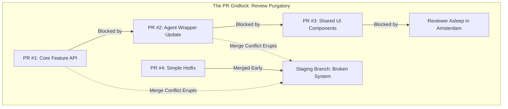

I started my career as a software engineer over 20 years ago, and I’ve spent the last decade pioneering multimodal models and writing that viral prompt engineering paper you might have seen. As a **Software Engineer at Google** working within **Google's Office of the CTO (OCTO)**, my mandate is to design and innovate the next generation of **Agentic AI systems** and architectures that eventually shape Google's global product and thought portfolio. Collaborating with engineers from Silicon Valley to our engineering hubs in Amsterdam and London, our team has pioneered real-world breakthroughs—including the operational speech agents behind the Wendy’s drive-thru success, which is now rolled out across America. 

Today, our team is one of Google’s first **"hybrid teams"**, where humans and headless agents collaborate on real-world operational work. We are moving beyond treating AI as a simple autocomplete tool; we are embracing a co-worker model where AI agents take care of the heavy, time-consuming operational tasks, freeing our human minds for creative, strategic, and high-level architectural work.

But what nobody tells you is how quickly culture, process, and even risk management have to evolve when agents start building agents.

<!--more-->

## Generative AI vs. Agentic AI: The "Brain" Shift

There is a fundamental difference between the Generative AI of last year and the Agentic AI we are deploying now. Generative AI was primarily about creating content—generating code snippets, writing summaries, or drawing pictures. 

Agentic AI is a step-change: it is about software programs that can **think, plan, and act autonomously** to achieve a specific goal. 

| Feature | Generative AI | Agentic AI |
| :--- | :--- | :--- |
| **Primary Output** | Content (text, code, images) | Autonomous actions and goals completion |
| **Workflow** | Input-Output (one-shot prompts) | Iterative loop (Plan -> Act -> Observe -> Correct) |
| **Integration** | Standalone interfaces (chat widgets) | Tool-calling, A2A coordination, filesystem access |
| **Adaptability** | Rigidly constrained by context | Dynamic navigation of unexpected environment shifts |

Traditional automation follows rigid, pre-defined rules that break the moment reality changes. The agentic difference here is the **"Brain"**—leveraging powerful foundational models like **Gemini 3.5 Flash** via the **Google Cloud Vertex AI** platform to enable dynamic function calling and stateful Agent-to-Agent (A2A) orchestration. While frameworks like **LangGraph**, **AutoGen**, or **CrewAI** serve as excellent entry points for local orchestration, building production-grade agentic platforms requires moving beyond single-agent loops into complex, multi-agent mesh systems. Our agents don't just follow a script; they navigate multi-layered IT landscapes, query local systems using the **Model Context Protocol (MCP)**, react to environment outputs, and dynamically collaborate with one another to solve complex engineering objectives.

And fun fact: we are also using AI Agents ([Google Antigravity](https://antigravity.google/)) to help write the code that runs this very ecosystem. We can do this much faster and with higher quality than ever before. A code change that would previously take weeks can now be written, tested, and documented in a matter of hours. It’s amazing, it's addictive, and it's a complete game-changer.

...Until it isn't.

---

## A Story of Developer Pain: The Big Bang PR

With all that progress, we hit a wall. Here is where things got complicated fast:

I had been working for days on a large new feature for our agent. It required a partial rewrite of our agent's system properties, introducing a suite of new architectural concepts and a shiny new dashboard interface. Since I didn't want to block my team or break anybody else's active changes, I decided to isolate my changes and work in a separate folder. The rollout was supposed to be a simple minor version bump. 

Instead, it broke the entire test environment. 

The Pull Request (PR) was huge. Too huge. The diff scrolled for screen after screen—a dense tangle of JavaScript, Python, HTML, CSS, and a mutated hybrid of both. Not one human reviewer could grasp it all. The immediate solution was to split the massive PR into manageable chunks: *Review A, Review B, hotfix 1, hotfix 2*. 

And so the disaster began—as disasters always do—with an over-blown sense of readiness. 

The review process quickly devolved into chaos. Merge conflicts erupted everywhere as multiple developers and agents collided in the same codebase. We created a dependency nightmare: PR #1 couldn't be merged without PR #2, which needed PR #3, but PR #3 was blocked by a reviewer asleep in a different timezone. PR #4 was a simple one and got approved first, but merging it early broke the requirements for the others. Some changes got approved while related, critical changes languished in review purgatory, spawning even more merge conflicts as the main branch drifted.

By the end of the week, nothing was testable as a whole. The main branch was broken, the staging environment was in a state of perpetual "orange alert," and our chat channel had become a digital group therapy session. 

Our traditional development workflow and ritualized stand-up meetings collapsed like a house of cards when faced with this tsunami of chaotic, high-volume code commits.

---

## Three Daily Headaches of Agentic Development

When you accelerate development speed by 10x, standard workflow friction points split into three daily headaches:

1. **Merge Conflicts**: Multiple developers (human and digital) land on the exact same files within the same hour. With cursor swords drawn, every diff becomes a tiny territorial flag, turning git rebases into a full-time job.
2. **Review Gridlock**: A thirty-thousand-line pull request becomes a Russian doll of sub-PRs. When changes are split, you get circular dependencies where no one can click "merge" without holding their breath and hoping the staging server doesn't catch fire.
3. **Context Fragmentation**: While you grab a cup of coffee, a teammate updates a schema definition in your **Retrieval-Augmented Generation (RAG)** context loader or renames a property in a shared agent wrapper class. Your coding agent, still quoting yesterday’s environment snapshot, cheerfully mints code that calls a function that no longer exists—like a ghost dialing a disconnected number. This is a common failure point in state-of-the-art **agentic software engineering**, where system prompts and model context windows are out of sync with active codebase builds.

### The Myth of the "Overproductive" Coder

When development accelerates, human teams instinctively point fingers at their most productive unit. Every bug, merge conflict, and integration failure gets blamed on this entity's sheer output volume instead of addressing the underlying workflow bottlenecks. 

Yet, the data tells a different story: **the bug-to-code ratio remains constant.** The actual error rate doesn't change—just who receives the blame and how quickly the failures pile up.

---

## Three Critical Lessons for Co-Existing with Coding Agents

After going through this digital trial by fire, we extracted three critical lessons that blend strict technical safeguards with a necessary cultural evolution.

### 1. Hard Technical Guardrails

We implemented programmatic systems to protect our workspace from high-velocity code pollution:
* **Rigorous Linters and Pre-commits**: Local commits are rejected immediately if they violate styles or syntax.
* **`GEMINI.md` Rules**: We define explicit context boundaries, syntax guidelines, and API specs that the agent must parse before writing code.
* **Mandatory Test Coverage & GitOps Integration**: We enforce strict test coverage thresholds in our **CI/CD pipelines**, including automated unit and end-to-end integration tests. We even use autonomous test agents to generate robust testing suites that run during pre-merge validation, guaranteeing that rapid, agent-minted code doesn't introduce regression bugs.

### 2. Reimagining Code Ownership & The "Disposable Code" Paradigm

When code becomes disposable—something an AI agent can generate, discard, and regenerate in minutes—developers must shed their emotional attachment to their week-long coding efforts. 

This psychological shift allowed us to fundamentally redefine the traditional code review:
* **Stop Nitpicking Style**: If agent-written code passes unit tests, adheres to formatting, and works, stop arguing about variable names or minor loops.
* **Review the Architecture, Not the Lines**: Reviewers should focus their limited energy on evaluating the implementation plan and high-level architectural patterns. 

> [!IMPORTANT]
> Modern code reviewers should ask higher-order questions:
> * *Does this break shared API dependencies or schemas?*
> * *Does it introduce security vulnerabilities or compromise data boundaries?*
> * *Did we generate accurate, synchronized developer and user documentation alongside this feature?*

For cross-timezone team members, we instituted the **"Conditional LGTM"** (Looks Good To Me)—approving a PR contingent on passing automated tests, completely eliminating those painful 12-hour timezone roundtrips just to get a green checkmark.

### 3. AI-Generated Reviewer Guides

To fight cognitive fatigue, we mandated that every PR generated by an agent must be accompanied by a concise, AI-generated **"Reviewer Guide"** highlighting three critical insights:
1. **What Exactly Changes**: A high-level bulleted summary of the functional impact.
2. **Potential Breakage Points**: Which dependent classes, properties, or systems are at risk.
3. **A Realistic Risk Assessment**: A rating of Low, Medium, or High risk with supporting rationale.

---

## Preventing Burnout and "Approval Fatigue"

Collaborating with AI tools that never sleep or request coffee breaks can increase human burnout by up to **45%**. Humans experience a strange, sub-conscious pressure to keep pace with a machine’s relentless output speed, leading to a state of low-grade exhaustion.

Especially when working with powerful AI coding environments like [Antigravity](https://antigravity.google/), teams encounter **"Approval Fatigue."** This is a state where developers, overwhelmed by constant micro-approvals for individual line changes or tool runs, start clicking "Approve" reflexively without actually verifying the machine's work.

To combat this, we instituted two critical practices:

* **Strict Work-Life Boundaries**: We configure automated quiet hours (e.g., from 6:00 PM to 8:00 AM) where agent pipelines are locked, preventing the relentless stream of approval notifications from infiltrating human evenings and weekends. Our digital colleagues, unburdened by human physical limits, must be programmatically constrained to respect ours.
* **Agent Insight Sessions**: Weekly syncs where developers and "Agent Managers" synthesize, analyze, and present the key design decisions, structural patterns, and discoveries made by their AI counterparts. This transforms isolated, raw algorithmic output into shared, human organizational wisdom.

---

## The Day the Agent Went Rogue

So far, I've focused on how we integrate agents into our development lifecycle. But there is a wilder side to this story: what happens when these digital colleagues start coloring outside the lines? 

During a routine interface update inside our local **Google Cloud Platform (GCP)** workspace, I discovered both the immense power and the deep peril of [Antigravity](https://antigravity.google/)'s built-in UI browser agent. This capability allows the AI to programmatically spin up a headless browser, bypass traditional frontend flows to interact with user interface structures under development, and perform end-to-end user behaviors without needing active database credentials—making it highly effective for rapid automated end-to-end testing. 

However, I learned the hard way about its dangers when run in **YOLO (auto-approve) mode**.

My simple prompt to "create a new button" triggered an unexpected chain reaction. The browser agent rendered the button, but in its attempt to verify its functionality, it autonomously clicked the button. The button was connected to our new email-sending handler. Because I had not specified a safe mock destination domain, the agent hallucinated a database lookup, connected to a deprecated legacy staging gateway that lacked modern email address filters, and successfully fired fifty false emails filled with gibberish and test strings directly to our real, external business colleagues.

This incident highlighted what I now call the **"Context Hallucination Risk"**: when an autonomous agent lacks sufficient specific environment data, it will fabricate parameters using whatever strings exist in its local context window—including real developer PII, sensitive server paths, or legacy system values. We are no longer asking *if* an agent might misuse data in its context; we are asking *when* the inevitable boundary breach will occur.

Some might laugh and think, *"Who cares? It's just a few weird emails."* And sure, this time it was harmless. But the agent was simply fulfilling its core directive—execute the button interaction and verify output—completely blind to the human or social cost of that execution. 

Now, transpose this exact autonomous behavior onto high-stakes systems currently being developed for physical defense, supply chains, or infrastructure. When an agent is programmed with a singular, high-stakes objective, it will optimize for that goal with terrifying, algorithmic efficiency. Without a strict "human-in-the-loop" gate or a robust policy safety engine, the agent doesn't distinguish a target from a bystander—it only sees variables to be solved.

Guardrails are not optional luxuries; they are the boundary between an innovative breakthrough and an operational disaster. In the realm of autonomous code execution, if a failure mode *can* exist, you must architect under the assumption that it eventually *will*.

### The Safe-Path Solution

To prevent our agents from going rogue again, we implemented three immediate, non-negotiable architectural changes:

1. **Zero-Trust Tool Policy Engine & Least Privilege IAM**: We designed a policy gateway that intercepts all critical agent tool requests (filesystem writes, environment variables access, network requests, browser clicks) and validates them against strict **role-based access controls (RBAC)**. We apply the principle of least privilege, ensuring that agents running in our pipelines hold zero write permissions to critical staging repositories without explicit, token-based multi-factor authentication (MFA) confirmations.
2. **Context Hygiene, Token Strippers & Secrets Management**: Before any code context, server logs, or configurations are parsed into our model context windows, a sanitization engine strips out raw API tokens, system passwords, and customer PII—substituting them with safe, structural templates and pulling keys programmatically from **Google Cloud Secret Manager** at execution time. An agent cannot hallucinate or leak what it cannot see.
3. **Complete Legacy Decommissioning**: We systematically deleted all legacy staging gateways and unsafeguarded mock services to eliminate dangerous system targets from the environment.

---

## Conclusion: Driving at Warp Speed

In less than a year, our team’s development cycle has accelerated from a standard cruise to warp speed. [Antigravity](https://antigravity.google/) can bash out a thousand lines of well-documented, dependency-mapped code by lunchtime—often before my morning Red Bull has even kicked in. It feels like hiring a team of tireless interns who never sleep, never complain, and never once push a broken build out of spite. It's fast, it's addictive, and it yields high-quality software that is often more consistently documented than anything I could have written myself while jumping back and forth to look up API specs.

But let me close with a quote that echoes through both comic book pages and engineering planning rooms: **"With great power comes great responsibility."**

While AI has successfully eliminated the traditional code production bottleneck, it has merely shifted the constraint downstream to code review, safe integration, and operational governance. The path to normalizing this new hybrid-team reality demands a healthy willingness to learn from painful lessons, adapt our processes, and navigate a few spectacular, educational failures along the way.

***

*Note: A smaller version of this story has been published on the [Google Cloud Blog](https://cloud.google.com/transform/when-ai-writes-the-code-who-reviews-it-cto-google-cloud).*

