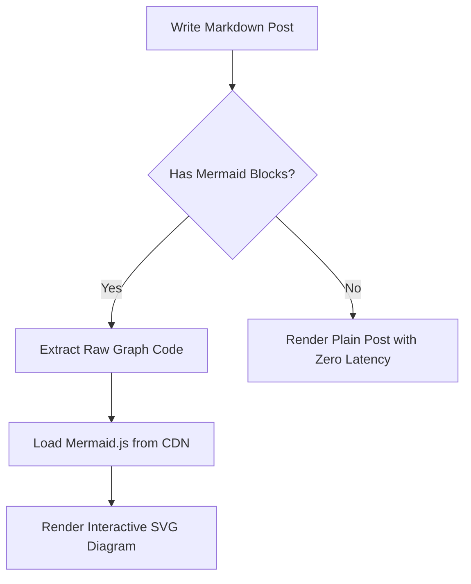
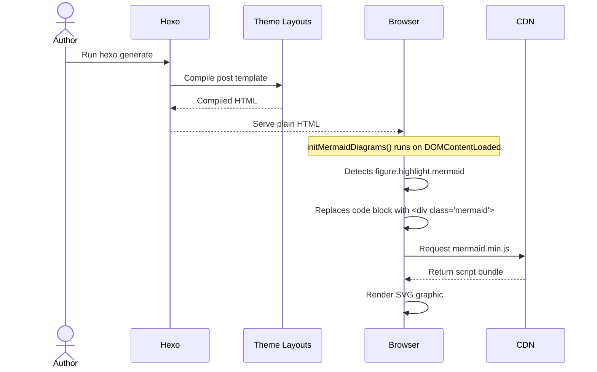

# Mermaid Diagram Verification Post

This is a temporary test post to verify that Mermaid diagram support has been successfully integrated into the Hexo blog posts.

## Simple Flowchart

## Sequence Diagram

