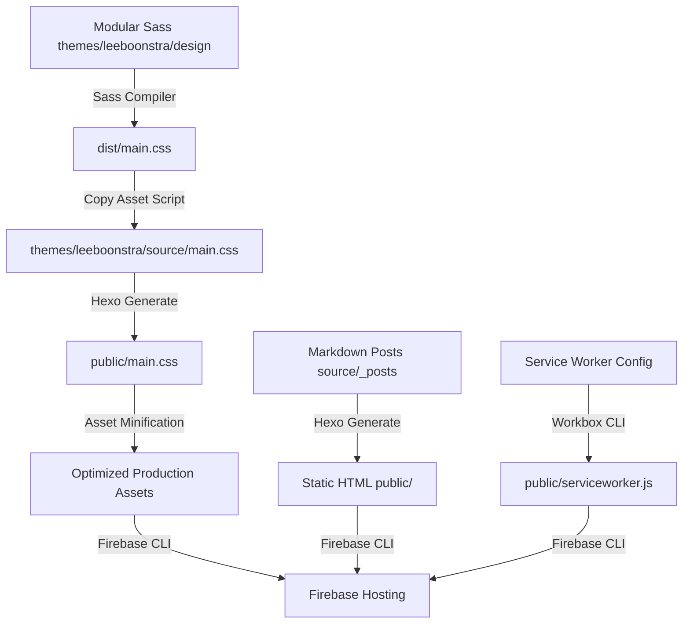

# TECHNICAL DESIGN: Hexo-Based Static Site and Assets Pipeline

This document specifies the architecture, build workflows, and custom pipelines of the Hexo-based static web application.

---

## 1. System Architecture Overview

The application is structured as a static site generation system leveraging **Hexo** with modular style packages and custom asset optimization post-processing pipelines. It is deployed to **Firebase Hosting**.



### 1.1 Component Stack & Technologies
- **Core Engine:** Hexo (v7.3.0)
- **Templating Engine:** EJS (Embedded JavaScript)
- **Style System:** SASS (`*.scss`) with Bootstrap 4 variables
- **Asset Bundling:** Parcel Bundler / Webpack
- **Minification & Optimization:** Terser (JS minification), Clean-CSS (CSS optimization)
- **PWA Capabilities:** Workbox CLI (Service Worker caching)
- **Hosting & CDN:** Firebase Hosting

---

## 2. Core Subsystems

### 2.1 Theme Architecture (`themes/leeboonstra/`)
The layout and presentations are driven by a custom theme structure:
- **`/layout`**: Contains layout definitions in `.ejs` (e.g. `layout.ejs`, `index.ejs`, partials for headers, footers, and article rendering).
- **`/source`**: Serves as the static assets source folder for the theme. Hexo automatically compiles/moves files inside this directory to the `public` directory upon build.
- **`/scripts`**: Local Hexo plugin scripts that extend Hexo behavior (e.g., custom asset preprocessing).

### 2.2 SASS & Client-side JS Compiler Subsystem (`themes/leeboonstra/design/`)
The theme styles are developed using standard modular CSS/Sass.
- **Input Stylesheet:** `src/sass/main.scss`
- **Compilation Script:** `sass-to-css.js` uses Dart Sass's `compile` feature to output optimized CSS to `dist/main.css` along with source map support.
- **Client JS Bundling:** Parcel packages `src/js/index.js` to `dist/bundle.js`.

### 2.3 Asset Build Post-Processor (`build-tools/build-assets.js`)
This Node.js script coordinates the design asset compilation:
1. Triggers Sass compiler in design folder.
2. Triggers JS compiler inside design folder (with error recovery fallback).
3. Copies `dist/main.css` to `themes/leeboonstra/source/main.css`.
4. Copies `dist/mobile-menu.js` and `dist/bundle.js` directly into `./public/`.

### 2.4 Image Processor (`build-scripts/process-images.js`)
To support high-performance responsive image rendering, the site employs a Jimp-based pre-processing script. 
1. **Input/Output Paths:** Raw source images are read from `source/images/` and compiled into `public/images/`.
2. **Size Variants:** For each image file, the processor generates four responsive dimensions maintaining the original aspect ratio:
   - `thumb_`: Max width 150px, max height 150px.
   - `small_`: Max width 640px, max height 640px.
   - `medium_`: Max width 1024px, max height 1024px.
   - `large_`: Max width 1800px, max height 1800px.
3. **Format Translation:** In addition to scaled variants in their original formats (PNG/JPEG), the pipeline compiles matching `.webp` replica versions.
4. **Jimp Decoding Memory Limits:** Jimp uses `jpeg-js` under the hood, which restricts decoder memory footprint to `512MB` by default. The pipeline explicitly overrides this threshold by passing `{ maxMemoryUsageInMB: 2048 }` to the decoder on `Jimp.read()` to process high-resolution source photos.
5. **Graceful Failure Fallback:** If Jimp fails to decode an image due to size constraints (exceeding even the 2048MB memory threshold), the pre-processor executes a graceful fallback by copying the original raw file to all required target paths. This prevents broken responsive image URLs and 404 errors at runtime.

### 2.5 Post-Render Minifier (`scripts/minify-assets.js`)
Runs after Hexo generation completes to compress client-side bundles:
- **JavaScript:** Uses `Terser` to drop console comments, drop debuggers, and minify files (e.g. `prism.js`, `mobile-menu.js`).
- **CSS:** Uses `Clean-CSS` with level-2 optimizations to optimize and minify Prism syntax highlighting styles.

### 2.6 Responsive Image Render Filter (`themes/leeboonstra/scripts/image.js`)
A custom Hexo filter registered on `after_post_render`.
- **Purpose:** Intercepts raw HTML post rendering and extracts Markdown `` tags.
- **Transformation:** Transforms `` tags into a robust `<picture>` wrapper that serves modern `.webp` formats optimized for multiple responsive viewport breakpoints:
  - Large WebP (Min-width: 1000px)
  - Medium WebP (Min-width: 500px)
  - Small WebP (Max-width: 499px)
  - Fallback base image with alt and title elements.

---

## 3. Deployment & Deployment Pipelines

The hosting targets **Firebase Hosting** (`leeboonstra-dev-7d578`).

```
[Clean previous build] 
       │
       ▼
[Build Styles/Assets] (Sass, JS copy)
       │
       ▼
[Generate Hexo Site] (source/ markdown to public/)
       │
       ▼
[Minify CSS/JS] (Terser & Clean-CSS)
       │
       ▼
[Build PWA Service Worker] (Workbox generation)
       │
       ▼
[Firebase Deploy] (Firebase Hosting)
```

---

## 4. Security & Governance Considerations
- **CDN Headers:** Cache-Control headers are explicitly declared in `firebase.json` to optimize edge caching (e.g. caching styles/scripts for 1 year `max-age=31557600`, but enforcing `no-cache` for `.html` index pages to ensure instant updates).
- **Secrets:** Firebase CLI credentials must be authenticated securely and must not be committed to version control.
